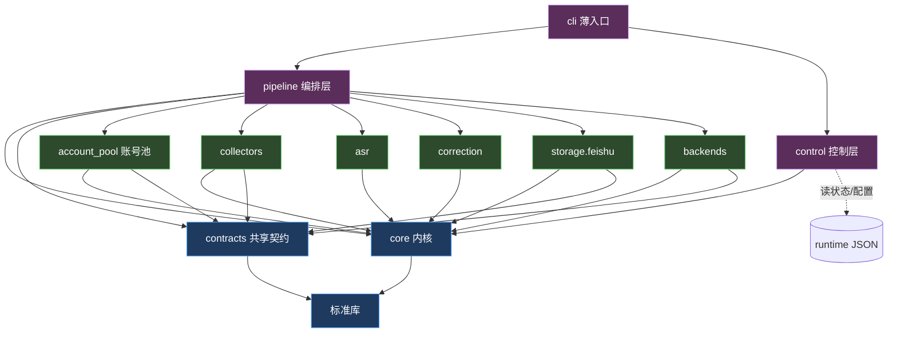

# 抖音达人监控项目 · 模块解耦设计方案

> 文档性质：纯架构评审（**不修改任何源码**，仅给出设计与迁移路线）
> 项目名称：`douyin_creator_monitor`（抖音达人日常作品监控自动化流水线）
> 设计人：架构师 高见远（Gao）  ·  日期：2026-08-16
> 配套自包含架构图：`docs/architecture/decouple-design-2026-08-16.html`

---

## 〇、给非程序员的「一句话白话版」

现在的程序就像一个**把所有家务塞进一个大抽屉、还用便利贴写命令**的房间：一个近 3600 行的 `run_creator_pipeline.py` 文件里，既管买菜（配置）、记账（日志）、派工（拼命令行）、又管钥匙（账号登录态）、还管每一步怎么做（采集/转写/纠正/写飞书/备份）。改一个小地方，可能别处悄悄出错。

本方案的建议是：**把抽屉换成带标签的格子的柜子**——底层放一套「公共工具」（读配置、记日志、统一路径、飞书封装、账号钥匙管理），中间一层放「每个步骤的标准动作卡（Stage）」，最上面一层放「遥控器（网页/桌面面板）」。所有格子**只向下依赖、不互相指手画脚**。这样以后改某一步，不会牵连其他步；每一步还能单独拿出来测试。柜子换了，但**平时一键启动的按钮、飞书写法、抖音采集方式、数据保护规则一概不变**。

---

## 一、TL;DR（结论先行）

**解耦后的目标形态**：在保留 `scripts/` 全部外部行为的前提下，新增一个统一 Python 包 `src/douyin_monitor/`，把当前散落在 3600 行「上帝模块」`run_creator_pipeline.py` 与各平铺脚本里的**公共能力（配置/日志/路径/状态/飞书封装/账号池）下沉为 `core/` 内核**，把**每个阶段从「拼 CLI 字符串 + subprocess」改成「统一签名的标准动作（Stage 对象）」**，把**三个备份下游统一到 `StorageBackend` 接口**，把**账号登录态锁抽成独立 `account_pool/` 子系统**，把**网页/桌面面板从「直接读内部 JSON + 调 schtasks」改为只依赖一个稳定的 `ControlAPI`**。编排层（`pipeline/`）只负责「按什么顺序、用什么并发、断点怎么续」，不再知道任何阶段脚本的命令行长相。

全程采用**绞杀者（strangler-fig）增量迁移**：每一阶段都保证 `run_daily.bat` 一键跑通、飞书只新增+覆盖更新、抖音采集仍走 MediaCrawler、密钥与运行产物仍在 `local/runtime/logs/` 里被 gitignore。绝不搞一次性大重写。

---

## 二、当前耦合诊断

下表基于实际阅读代码（README / AGENTS.md / `run_creator_pipeline.py` 3627 行 / 代表性阶段脚本 / 共享契约 / Web·GUI 控制层）归纳，逐条给出**现状、风险、严重度**。

| # | 耦合点 | 现状（代码实证） | 风险 | 严重度 |
|---|--------|------------------|------|--------|
| 1 | **上帝模块** | `run_creator_pipeline.py` = 3627 行，混装 `Logger`、`Runner`、`CommandError`、配置解析（`section/chosen/path_from`）、状态模型（`STAGES`/`load_state`/`set_status`）、账号池（约 18 个函数，`_user_data_dir_for_key`/`_has_valid_login`/`browser_profile_file_lock`/`refresh_primary_profile_replicas`/`account_profile_keys`…）、每个阶段的命令拼装（`collect_command`/`sync_command`/`transcribe_command`…）、主编排循环（`process_creator_phase`/`process_work`/`process_downstream`）、backfill 选择逻辑。 | 单文件过大，无法并行开发；改 A 处易误伤 B 处；新人无从下手；无单测。 | 🔴 高 |
| 2 | **编排层 ↔ 阶段脚本靠「CLI 参数形状」强耦合** | 编排用 `py(config,"script.py",*args)` + `append_option(...)` 拼出命令行，再 `subprocess.Popen` 调兄弟脚本（`collect_command` 等几十行拼参）。改某脚本的参数名/默认值会**静默**破坏编排，无类型/签名约束、无复用单元。 | 阶段脚本与编排互为「字符串契约」，重构即回归；无法单测某阶段。 | 🔴 高 |
| 3 | **横切能力重复实现** | 每个脚本各自重写 argparse、`read_json`、配置加载（`SCRIPT_DIR`/`sys.path.insert(0,...)` 把自身目录塞进 path）、lark-cli 封装（`run_lark`/`scoped_lark_command`/`isolated_lark_env`/`resolve_lark_cli` 在 `feishu_transcript_writer.py` 等多处重复）、文件/JSON I/O。 | 复制粘贴漂移：改一处逻辑（如 token 脱敏、隔离环境）要在 N 个脚本同步，易漏。 | 🟠 中 |
| 4 | **共享契约分散在 `scripts/` 平铺目录** | 作品表字段 `work_table_schema.py`、达人基础表字段 `creator_table_fields.py`（含 `validate_*_patch` 校验器）、`local/pipeline.json` 配置结构是多个脚本的中心契约，却散落在脚本目录，没有「共享核心层」。 | 契约改动无单一权威点；新模块不知道该 import 谁；`web_dashboard` 直接 import `run_creator_pipeline`/`collect_..._mediacrawler` 暴露内部。 | 🟠 中 |
| 5 | **状态/产物/配置靠文件约定字符串共享** | runtime JSON 路径、`artifact_paths(media_dir, work_id, provider)`、`runtime/pipeline/<key>/<work>.json`、`runtime/pipeline/runs/*.json` 等路径硬编码字符串拼接，散落各处。 | 改目录约定要全仓搜改；路径拼写错只在运行时爆。 | 🟡 低-中 |
| 6 | **控制层（Web/GUI）直接读内部状态 + 调 schtasks** | `web_dashboard.py`（55KB）直接 `glob("runtime/pipeline/runs/*.json")`、读各作品 state JSON、自带 `read_json_object`；GUI 同样直接读状态并 `[schtasks,/run,/tn,DouyinCreatorMonitor]`。二者还 `import run_creator_pipeline as PIPELINE` / `import gui_dashboard` / `from collect_..._mediacrawler import ...`。 | 控制层与流水线实现细节紧绑，无法独立演进/测试；内部字段一改名，面板崩。 | 🟠 中 |
| 7 | **`scripts/` 是平铺独立 CLI 集合，无 package 结构** | 30+ 个平铺 `.py`，靠「把脚本目录塞进 `sys.path`」当包用；无清晰模块边界、无统一入口包、无 `pyproject`/`__init__` 分层。 | 没有可复用的「库」；编排只能 shell out；IDE/类型检查/打包全失效。 | 🟠 中 |

> 补充实证：`feishu_transcript_writer.py` import `verify_feishu_cli_identity`（`isolated_lark_env`/`scoped_lark_command`）；`feishu_work_status_writer.py` import `feishu_transcript_writer`；`web_dashboard.py` 顶层 import `run_creator_pipeline`、`gui_dashboard`、`collect_douyin_creator_with_mediacrawler`——证明耦合是多向的、隐性的。

---

## 三、解耦目标与原则

| 原则 | 说明（大白话） |
|------|----------------|
| **1. 单一职责** | 一个文件/模块只干一类事：日志就只管日志，飞书就只管飞书，编排就只管顺序。 |
| **2. 依赖方向单向、无环** | 上层（控制层/编排）依赖下层（业务模块/内核），**下层绝不反向依赖上层**，更不允许循环。像水往低处流。 |
| **3. 稳定接口、可变实现** | 阶段间只约定「动作卡（Stage）」的标准签名、飞书用 `LarkClient`、备份用 `StorageBackend`、账号用 `AccountPool`。内部怎么实现随便改，只要接口不变，别人不受影响。 |
| **4. 增量可落地（绞杀者模式）** | 不一次性重写。新包与旧脚本并行存在，一次只搬一层，每步都能一键跑通、可回滚。 |
| **5. 保持运行不中断** | `run_daily.bat` 对外行为不变；飞书只新增+覆盖更新；MediaCrawler 仍是唯一采集真源；密钥/登录态继续在 `local/runtime/` 被忽略。 |

---

## 四、目标架构设计

### 4.1 推荐的目录 / 包结构

新增统一包 `src/douyin_monitor/`（可提交），旧 `scripts/` 在过渡期保留为「调试薄壳」。

```
douyin_creator_monitor/
├── run_daily.bat                 # 仅改 1 行：指向新薄 CLI（python -m douyin_monitor.cli.run_pipeline），行为不变
├── run_web.bat / run_gui.bat     # 指向控制层新入口（行为不变）
├── install_task.bat              # 不变（Windows 任务计划注册）
├── src/
│   └── douyin_monitor/           # ★ 新统一包（可提交）
│       ├── __init__.py
│       ├── __main__.py           # `python -m douyin_monitor` 入口分发
│       │
│       ├── core/                 # 【内核】不依赖任何业务模块，只依赖标准库 + contracts
│       │   ├── errors.py         # PipelineError / CommandError / CommandTimeoutError / Profile*Error
│       │   ├── config.py         # Config 加载器 + 类型化访问（section / chosen / path_from 收敛）
│       │   ├── logging.py        # Logger（替代原 Logger 类，带锁、时区、脱敏）
│       │   ├── runner.py         # Runner + 进程树终止 + 指标（替代原 Runner / terminate_process_tree）
│       │   ├── paths.py          # ArtifactPaths：runtime 产物路径统一抽象（替代 artifact_paths 散拼）
│       │   ├── state.py          # PipelineState / WorkState 数据模型 + load/set_status（替代 STAGES/load_state）
│       │   └── lark.py           # LarkClient：封装 lark-cli + 身份预检 + 隔离环境（收敛各脚本重复实现）
│       │
│       ├── contracts/            # 【共享契约】被多模块依赖的中心定义（从 scripts/ 迁入）
│       │   ├── work_table_schema.py    # 作品表字段（原 scripts/work_table_schema.py）
│       │   ├── creator_table_fields.py# 达人基础表字段 + validate_*_patch（原 scripts/creator_table_fields.py）
│       │   └── feishu_ids.py           # base token / 飞书字段名解析（从各脚本收敛）
│       │
│       ├── account_pool/         # 【账号池子系统】抽出自上帝模块的 ~18 个账号/登录态函数
│       │   ├── profiles.py       # 目录定位 / 登录态校验 / 文件锁
│       │   └── pool.py           # 账号选择 / 故障切换 / 主账号副本刷新 / CDP 端口分配
│       │
│       ├── collectors/           # 【采集阶段】MediaCrawler 唯一真源，不被替换
│       │   └── mediacrawler_collector.py  # 包装 collect_douyin_creator_with_mediacrawler.py
│       │
│       ├── asr/                  # 【转写阶段】
│       │   ├── base.py           # AsrProvider 协议
│       │   ├── volcengine.py     # 火山 ASR（原 volcengine_asr.py）
│       │   └── bailian.py        # 百炼 Paraformer（原 bailian_paraformer.py）
│       │
│       ├── correction/           # 【文案纠正阶段】
│       │   └── corrector.py      # 复用 correct_transcript.py 的纯函数（glossary/replace/candidates）
│       │
│       ├── storage/
│       │   └── feishu/           # 【飞书读写】含数据保护硬规则
│       │       ├── works_table.py     # 作品表：新增 + 覆盖更新（禁止删除 / 空值清空）
│       │       ├── transcript_writer.py
│       │       ├── status_writer.py
│       │       └── creator_table.py    # 达人基础表：接入 / 资料 / 备份映射回写
│       │
│       ├── backends/             # 【三处下游备份】统一接口
│       │   ├── base.py           # StorageBackend 协议（ensure_target / upload / status_of）
│       │   ├── ima.py            # 原 backup_transcripts_to_ima.py
│       │   ├── kuake.py          # 原 backup_transcripts_to_kuake.py
│       │   └── obsidian.py       # 原 export_transcript_to_obsidian.py
│       │
│       ├── pipeline/             # 【编排层】解耦地驱动各 Stage
│       │   ├── context.py        # StageContext：注入 config/paths/state/lark/pool/runner 等
│       │   ├── stage.py          # Stage 协议（统一签名，替代「拼 CLI 字符串」）
│       │   ├── stages/           # 各阶段适配器（过渡期=薄壳调原脚本；后期=进程内调用）
│       │   │   ├── collect_stage.py / sync_stage.py / transcribe_stage.py
│       │   │   ├── correct_stage.py / summarize_stage.py / writeback_stage.py
│       │   │   ├── status_writeback_stage.py / ima_stage.py / kuake_stage.py / obsidian_stage.py
│       │   ├── orchestrator.py   # PipelineOrchestrator（替代原主编排循环）
│       │   ├── scheduler.py      # 达人/作品级并发 + backfill 选择
│       │   └── resume.py         # 断点续跑 / 幂等（should_skip / force_stage）
│       │
│       ├── control/              # 【控制层解耦】Web/GUI 只依赖此稳定 API
│       │   ├── api.py            # ControlAPI：只读查询 + trigger_run(schtasks) + save_config（原子+备份）
│       │   ├── web_app.py        # 新 web_dashboard（基于 ControlAPI 重建）
│       │   └── gui_app.py        # 新 gui_dashboard（基于 ControlAPI 重建）
│       │
│       └── cli/                  # 【薄入口】run_daily.bat 调用它
│           ├── run_pipeline.py   # 替代 run_creator_pipeline.py 的调用入口（解析 argv → 组装 Config → orchestrator.run）
│           ├── onboard.py        # 包装 check_and_onboard_new_creators.py（reconcile/apply）
│           ├── verify_identity.py# 包装 verify_feishu_cli_identity.py（身份预检）
│           ├── web.py / gui.py   # 启动控制面板
│
├── scripts/                     # 过渡期：原脚本逐步变为「python -m douyin_monitor.cli.X」的薄壳（保留调试入口）
├── config/                      # 可提交模板（不变）
├── local/  runtime/  logs/  output/   # 仍被 .gitignore 忽略（不变）
└── docs/                        # 不变
```

### 4.2 依赖方向图（谁依赖谁，禁止反向/循环）



**关键不变量**：
- `core` 与 `contracts` 是叶子，**不依赖任何业务模块**，只依赖标准库。
- 业务模块（`collectors/asr/correction/storage/backends/account_pool`）**只向下依赖 `core`/`contracts`**，绝不依赖 `pipeline` 或彼此。
- `pipeline` 依赖业务模块与内核，但**不被业务模块反向依赖**。
- `control` 只依赖 `core`（只读查询）+ 通过 `schtasks` 触发，**不 import `pipeline` 的编排细节**，因此可独立测试/演进。
- `cli` 是唯一的「装配点」，把上述一切串起来。

### 4.3 模块边界与接口契约（核心抽象）

下面 6 个抽象是解耦的「承重墙」。每个都来自对现有代码的收敛，而非新发明。

#### (1) `Config`（配置加载器，替代 `section/chosen/path_from/read_json` 散落）
```python
class Config:
    def __init__(self, data: dict): ...
    @classmethod def load(cls, path: Path) -> "Config": ...      # 原 read_json
    def section(self, name: str) -> dict: ...                   # 原 section()
    def chosen(self, creator: dict, key: str, default=None): ... # 原 chosen()：达人覆盖→段落默认
    def path(self, value) -> Path | None: ...                   # 原 path_from()
    def creators(self, enabled_only=True) -> list[dict]: ...     # 已启用达人列表
```
收益：所有「读配置」逻辑一处实现；阶段脚本不再各自 `json.load`。

#### (2) `ArtifactPaths`（产物路径抽象，替代 `artifact_paths` 与各处字符串拼接）
```python
class ArtifactPaths:
    def __init__(self, media_dir: Path, work_id: str, provider: str): ...
    @property
    def raw_text(self) -> Path: ...
    @property
    def raw_json(self) -> Path: ...
    @property
    def final(self) -> Path: ...
    @property
    def report(self) -> Path: ...
    @property
    def summary(self) -> Path: ...
    @classmethod
    def for_work(cls, runtime_dir, creator_key, work_id, provider) -> "ArtifactPaths": ...
```
收益：runtime 目录约定集中管理，改路径只动一处。

#### (3) `WorkState` / `PipelineState`（状态模型，替代 `STAGES`/`load_state`/`set_status`）
```python
@dataclass
class WorkState:
    aweme_id: str
    stages: dict[str, str]          # 阶段名 → 状态(success/failed/skipped/planned/blocked/...)
    # 类方法
    @classmethod def load(cls, path, creator, work) -> "WorkState": ...   # 原 load_state
    def status_of(self, stage: str) -> str: ...                          # 原 status_of
    def set_status(self, stage: str, value: str, *, detail="") -> None: ...# 原 set_status
    def persist(self) -> None: ...
```
收益：状态读写有类型、可单测；编排层只调 `state.set_status(...)`，不知道 JSON 长什么样。

#### (4) `Stage` 协议（统一签名，**替代「拼 CLI 字符串」**）
```python
@runtime_checkable
class Stage(Protocol):
    name: str
    granularity: str                # "creator"（采集/映射）或 "work"（转写→备份）
    def run(self, ctx: "StageContext", item: dict, state: "WorkState | None") -> "StageResult": ...

@dataclass
class StageResult:
    status: str                     # success / failed / skipped / planned / blocked
    record_id: str | None = None
    detail: str = ""
```
- 每个阶段（采集/同步/转写/纠正/总结/回写/状态回写/IMA/夸克/Obsidian）都实现 `Stage`。
- 过渡期实现体内仍可用 `ctx.runner.run(...)` 调原脚本（保持行为不变）；后期可改成进程内调用纯函数。
- **编排层不再知道任何阶段的命令行长相**——它只 `result = stage.run(ctx, work, state)`。

#### (5) `LarkClient`（飞书封装，收敛各脚本重复的 lark-cli 调用 + 身份预检）
```python
class LarkClient:
    def __init__(self, config: Config, logger: Logger): ...
    def verify_identity(self) -> bool: ...                 # 原 verify_feishu_cli_identity
    def find_record_by_work_id(self, table_id, work_id, field) -> str: ...
    def upsert_record(self, table_id, record_id, patch: dict) -> dict: ...
    def batch_update(self, table_id, manifest: Path) -> dict: ...
    def search(self, table_id, keyword, field) -> list[dict]: ...
```
收益：飞书身份隔离（`isolated_lark_env`/`scoped_lark_command`）、token 脱敏、批量写回只实现一次；所有飞书 writer 共用。

#### (6) `StorageBackend`（三处备份统一接口）
```python
@runtime_checkable
class StorageBackend(Protocol):
    name: str                       # "ima" / "kuake" / "obsidian"
    def ensure_target(self, creator: dict) -> "DirRef": ...   # 确认/创建目录（带缓存）
    def upload(self, work: dict, text: str, paths: ArtifactPaths) -> "Result": ...
    def status_of(self, work: dict) -> str: ...               # 已上传/失败/跳过…
```
IMA / 夸克 / Obsidian 各实现一个 `StorageBackend`。编排层用同一个循环遍历三者，**失败互不影响**（与现状一致），映射同步由 `BackupCoordinator` 并行 `ensure_target` 后一次性回写飞书差异（现状保留）。

> 账号池子系统（第 4.5 节）与编排驱动（第 4.4 节）见下。

### 4.4 编排层（`pipeline/`）如何解耦地驱动各 Stage

**现在（耦合）**：
```
orchestrator: cmd = collect_command(config, creator, ...)   # 几十行拼 CLI 参数
             runner.run("采集", cmd, env)                    # subprocess 调兄弟脚本
```
改 `collect_douyin_creator_with_mediacrawler.py` 的参数 → `collect_command` 静默出错 → 编排崩。

**目标（解耦）**：
```
orchestrator: stage = registry["collect"]          # 拿到 Stage 对象
             result = stage.run(ctx, creator, state)# 调统一签名，内部自己用 core 服务
             state.set_status(stage.name, result.status)
```
- 编排层只认 `Stage` 协议，**与阶段内部实现、命令行形状完全解耦**。
- `StageContext` 在编排启动时一次性注入：`config / paths 根 / state 工厂 / lark / account_pool / runner / logger`。阶段按需取用，不再自行 `sys.path` 塞目录、不再自行 `json.load` 配置。
- 阶段可单测：测试时把 `ctx` 换成 mock 的 `Config`/`LarkClient`/`ArtifactPaths` 即可，无需真正抓抖音或写飞书。
- 并发与 backfill 选择留在 `scheduler.py`/`resume.py`，与「每个阶段做什么」彻底分开。

### 4.5 账号池 / 登录态锁抽成独立子系统 `account_pool/`

把上帝模块里约 18 个账号相关函数（`_user_data_dir_for_key`、`_has_valid_login`、`browser_profile_file_lock`、`_primary_profile_generation`、`_refresh_profile_replica`、`refresh_primary_profile_replicas`、`_find_fallback_profile_key`、`account_profile_keys`、`per_creator_profile_pool_enabled`、`account_profile_candidates`、`effective_collection_workers`、`runtime_blocked_account_profiles`、`runtime_profile_lock`、CDP 端口计算等）整体迁入，对外只暴露一个类：

```python
class AccountPool:
    def __init__(self, config: Config, logger: Logger): ...
    def profile_for(self, creator: dict) -> "ProfileHandle":  # 选主账号/回退/故障切换
    def refresh_replicas(self, creators: list[dict]) -> "RefreshReport":  # 主账号→达人副本刷新
    def acquire_lock(self, key: str): ...                     # 上下文管理器（浏览器目录互斥）
    def mark_blocked(self, key: str) -> None: ...
    def is_valid(self, key: str) -> bool: ...
    def cdp_port_for(self, creator: dict) -> int: ...
```
- 采集阶段只调用 `pool.profile_for(creator)` 拿到「该用哪个登录态 + 哪个 CDP 端口」，不再在编排里散算。
- 所有文件锁、登录态校验、主备切换逻辑**集中、可单测**，且天然支持现状的「`per_creator_profile_pool` 并发 / 账号 blocked 切换备用 / 主账号副本刷新」全部既有行为。

### 4.6 控制层（Web/GUI）解耦

**现在**：`web_dashboard.py` 直接 `glob("runtime/pipeline/runs/*.json")`、`import run_creator_pipeline as PIPELINE`、自己实现 `read_json_object`，GUI 直接读状态 + `schtasks /run`。

**目标**：引入稳定的 `ControlAPI`，Web/GUI **只依赖它**，绝不直接读内部 JSON、绝不直接 import 编排模块：

```python
class ControlAPI:
    def load_config(self) -> Config: ...
    def list_creators(self) -> list[dict]: ...
    def query_run_status(self) -> dict: ...            # 读 runtime/pipeline/runs/*.json（只聚合成人话摘要）
    def query_creator_status(self, key) -> dict: ...   # 读 runtime/pipeline/<key>/*.json（只读）
    def trigger_run(self) -> int: ...                  # 仍只调用 schtasks /run /tn DouyinCreatorMonitor
    def save_config(self, payload) -> Path: ...        # 原子保存 + local/pipeline.backup.json
```
好处：
1. **稳定边界**：内部状态字段改名，只需改 `ControlAPI` 一处，面板不崩。
2. **可独立测试/演进**：Web/GUI 可单独跑、单独改，不碰流水线核心。
3. **行为不变**：「立即运行」仍只 `schtasks /run`（不直跑 Python），满足 AGENTS.md「运行不经 AI Agent 沙箱」与 README 的 Web/GUI 约定。
4. 现状的并发登录锁、账号池扫码、配置校验、备份策略分组等 UI 逻辑全部保留，只是底层数据来源从「裸读 JSON」换成「`ControlAPI` 查询」。

---

## 五、硬约束遵守清单（逐条确认）

| 约束 | 方案如何满足 | 状态 |
|------|--------------|------|
| **1. 运行入口不中断** | `run_daily.bat` 仅把 `PYTHON` 目标从 `scripts/run_creator_pipeline.py` 改为 `python -m douyin_monitor.cli.run_pipeline`（同一 argv 透传）；bat 其余逻辑（加载 `local/.env`、lark 身份预检、reconcile/onboard、退出码聚合）保持不变。Web/GUI 仍经 `schtasks /run` 触发。 | ✅ 满足 |
| **2. 数据保护规则** | 飞书「新增+覆盖更新、禁止删除、禁止空值清空、保留未抓到作品」作为 `storage/feishu/works_table.py` 的**硬不变量**显式编码（upsert 只写本轮已确定字段；遇缺失作品记录原样保留；完整性校验仍在写入后执行）。不引入任何会破坏此规则的结构。 | ✅ 满足 |
| **3. MediaCrawler 唯一真源** | `collectors/mediacrawler_collector.py` 仅**包装** `collect_douyin_creator_with_mediacrawler.py`（及其对 MediaCrawler 的调用），采集逻辑不被替换/弱化；该阶段仍保留为对外部 MediaCrawler 的 subprocess 边界。 | ✅ 满足 |
| **4. gitignore 边界** | 新包 `src/` 全量可提交；`local/ runtime/ logs/ output/` 继续被忽略；密钥仍走环境变量 / `local/` 私有文件；新包不新增被提交的敏感产物。`config/` 模板保持可提交。 | ✅ 满足 |
| **5. 复用 / 省成本 / 不重型化** | 纯 Python 标准库 + 已有 `lark-cli`/MediaCrawler/夸克 CLI 等外部进程；**不引入 Docker/K8s/消息队列/数据库/Web 框架**。运行时仍是单机单进程、0 token（与现状一致）。解耦收益在于可维护性，而非堆基础设施。 | ✅ 满足 |
| **6. 用户无编程背景 / 直观** | 本设计文档配「白话版」+ 表格；配套 HTML 架构图用深色主题 + 色块分层 + 中文标签 + 图例，给非程序员直观呈现「现在 vs 将来」。 | ✅ 满足 |

---

## 六、增量迁移路线（绞杀者模式 · 每阶段均可一键跑通 + 可回滚）

> 总原则：**每完成一个阶段，`run_daily.bat` 必须仍能一键跑通、飞书写法不变、采集不变、数据保护不变。** 回滚方式统一为「把 `run_daily.bat` 的 `PYTHON` 目标指回旧脚本」。

| 阶段 | 做什么 | 产出 | 风险 | 回滚 |
|------|--------|------|------|------|
| **P0 建骨架 + 下沉内核（无行为变更）** | 新建 `src/douyin_monitor/` 包与 `__init__`；把 `Logger`/`Runner`/`CommandError`/`read_json`/`section`/`chosen`/`path_from`/`artifact_paths`/`STAGES`/`load_state` 等纯逻辑迁入 `core/`（不改任何外部行为）；`contracts/` 迁入两个 schema 文件。 | 可 import 的内核包；旧 `scripts/run_creator_pipeline.py` 暂未改动。 | 极低（纯搬运）。 | 删 `src/` 即可，旧脚本完全未动。 |
| **P1 契约与身份封装收敛** | `feishu_transcript_writer` 等脚本改为从 `douyin_monitor.core.lark` / `contracts` import（保留兼容 import shim）；把各脚本重复的 lark-cli 封装与 `verify_feishu_cli_identity` 收敛进 `core/lark.py` 的 `LarkClient`。 | 飞书调用统一；身份预检逻辑唯一。 | 低。 | 还原 import shim，旧实现仍在。 |
| **P2 薄 CLI 切换入口（首个对外变更）** | 新增 `cli/run_pipeline.py` 作为薄壳：解析 argv → `Config.load` → 调原 `run_creator_pipeline.main()`（或 subprocess 调旧脚本）。`run_daily.bat` 改指新薄 CLI。 | `run_daily.bat` 入口换成新包，但**实际逻辑仍是旧上帝模块**，行为 100% 不变。 | 低（等价替换）。 | bat 指回旧脚本路径。 |
| **P3 账号池 + Stage 化编排（隔离耦合点）** | 抽出 `account_pool/`（18 个函数整体迁入）；新建 `pipeline/`：`Stage` 协议 + 10 个阶段适配器（过渡期适配器体仍 `ctx.runner.run(...)` 调原脚本，等价于现状）+ `orchestrator`/`scheduler`/`resume`。`cli/run_pipeline` 改为装配 `Config/core/account_pool` 后调 `orchestrator.run()`。 | 编排层不再手拼 CLI 字符串（耦合被关进各 Stage 适配器内部）；账号逻辑独立可测。 | 中（编排重写，但有「等价 subprocess」保底）。 | bat 指回旧脚本；`scripts/` 原文件保留未删。 |
| **P4 进程内提升（逐阶段，可单测）** | 逐个把 Stage 适配器从「subprocess 调原脚本」提升为「进程内 import 纯函数」：先 `corrector`（纯函数最易）、再 `asr`/`storage.feishu`/`backends`，每升一个阶段补单测；MediaCrawler 采集保持 subprocess。 | 阶段可单测、无进程启动开销；`scripts/` 原脚本退化为调试薄壳。 | 中（每步带测试）。 | 该 Stage 回退为 subprocess 适配器。 |
| **P5 控制层重建** | Web/GUI 改为基于 `control/api.py` 的 `ControlAPI`（只读查询 + `schtasks` 触发 + 原子存配置）；删去对 `run_creator_pipeline`/`collect_..._mediacrawler` 的直接 import。 | 控制层与流水线实现解耦，可独立演进/测试。 | 低-中。 | 旧 `web_dashboard.py`/`gui_dashboard.py` 仍在，指回即用。 |

> 说明：P2→P3 是最关键的一跳，但因为有「P3 阶段适配器仍 subprocess 调原脚本」的保底，P3 实际等价于现状行为，可放心落地。真正的内核重写（P4）是**逐阶段、带测试、可单独回退**的，不会一次性大改。

---

## 七、风险与待确认问题（需用户拍板）

| # | 待确认点 | 建议 | 影响 |
|---|----------|------|------|
| 1 | **是否接受引入 `src/` 包结构**（而非继续在 `scripts/` 里加文件）？ | 是。这是解耦的前提，且不破坏现有行为。 | 决定整体方向 |
| 2 | **包名用 `douyin_monitor` 还是沿用 `douyin_creator_monitor`？** | 推荐 `douyin_monitor`（更短、作为包名更顺）。 | 影响所有 import 路径 |
| 3 | **迁移后是否保留 `scripts/` 下的原脚本作为「调试薄壳」？** | 建议保留：每个脚本退化为 `if __name__=="__main__": sys.exit(stage_main())`，方便单步排障，且兼容老习惯。 | 影响目录整洁度 |
| 4 | **是否要我（架构师）后续产出 P0/P1 的具体代码骨架（仍不碰 `scripts/` 现有逻辑）？** | 本任务仅出设计；如需落地 P0/P1 骨架可另开实施任务。 | 排期 |
| 5 | **`check_and_onboard_new_creators.py`（49KB，reconcile/onboard/profile 接入）是否纳入本轮解耦？** | 建议本轮**先不动**，保持它作为 `cli/onboard.py` 的独立调用对象；第二阶段再抽 `onboarding/` 模块。降低首轮风险。 | 范围 |
| 6 | **是否引入 `pyproject.toml` + 相对 import（取代 `sys.path.insert`  hack）？** | 强烈建议，随 `src/` 一并引入，使 IDE/类型检查/打包生效。 | 工程化 |

> 以上 1–3、6 为「yes/no」类决策；4–5 为范围/排期类。请主理人汇总结论后告知，我再据以细化或进入实施。

---

## 八、一句话总结给主理人

> 把 3600 行上帝模块「拆柜子」：公共能力下沉 `core/`、每个步骤变标准动作卡 `Stage`、三处备份统一 `StorageBackend`、账号钥匙独立 `account_pool/`、网页桌面只认稳定 `ControlAPI`；用绞杀者模式分 6 阶段增量落地，**全程一键可跑、飞书写法/抖音采集/数据保护/密钥边界一律不变**，不引入任何重型基础设施。
